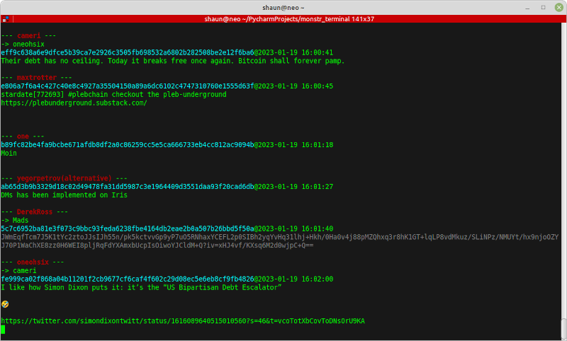

# event view
view text and encrypted text events as they arrive at relay and back to a set number of hours.
Also supports viewing of events that have been encrypted and wrapped into an inbox account. 



view all event as they come in:
```shell
python event_view.py 
```
view events for a given user, also an extra user that's not in thier follows and check in additional inbox:
```shell
python event_view.py --as=<key or alias> --view=<key or alias> --via=<key or alias>
````
note that the view will be made by looking up the contacts event for the given key so that needs to be available 
on the used relays. When a user is given encryped text will automatically be decrypted. 

for other options:
```
python run_relay.py --help
```

# poster
post text or encrypted text events to nostr relays. 
Also events can be sent via an inbox - just another nostr 
keypair so that only users who have that private key can see messages and who is 
communicating. It can be open in a loop mode that can work as a very basic chat interface. 


send a plain text post:
```shell
python poster.py -p --as=<key or alias> hello there
```
send encrypted post to another user:
```shell
python poster.py --as=<key or alias> --to=<key or alias> hello there
```
plain post in loop mode using a mailbox - only other users with key to the mailbox will be able to view messages: 
```shell
python poster.py -pl --as=samwise --via=nsec1fj2n37y66l848jg0nps9c7axfk3zhmll540plklnxyt2dhga7u5qjzhkyd
```
# alias
creates named aliases to keys so they can be referenced by user friendly name.

create a new key and alias:
```shell
python alias.py -n monty        
```
for other options
```
python alias.py --help
```
# relay
basic relay implementation: 

to run the relay:
```shell
python run_relay.py        
```
for other options:
```
python run_relay.py --help
```
